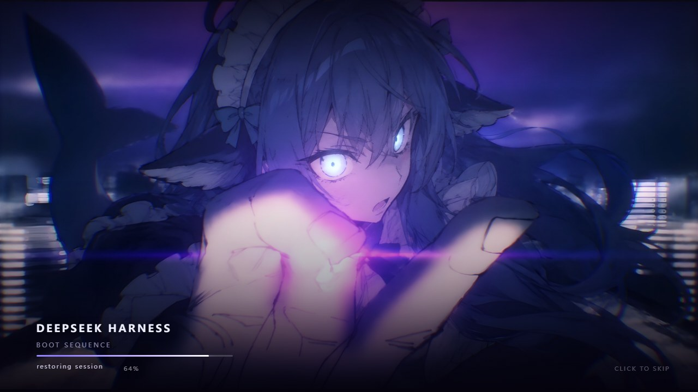

# dsh-boot-splash

DeepSeek Harness 的**开机动画插件**：把一张图变成一个全屏启动序列 —— 画面在**第一帧**就位，启动期间缓慢推进、有一道横向光带扫过，应用挂载完成的瞬间闪一下并淡出。



## 效果

- **全屏主视觉**：图片 `cover` 铺满，从 1.14 倍缓缓落到 1.005 倍（settle）
- **横向光带**：一道带辉光的扫描光带从左扫到右（呼应原图里的光带）
- **中心辉光**：画面中央的紫色光晕由暗到亮，随呼吸停在中段
- **HUD**：左下 `DEEPSEEK HARNESS` 字标（字距 0.44em → 0.17em 收拢 + 去模糊浮现）、副标题、进度条（先自行推进到 88%，就绪时补满）、阶段文案（初始化内核 → 装载插件 → 恢复会话 → 就绪）、右上角百分比
- **跳过**：点击屏幕任意处，或按 `Esc` / `空格` / `Enter`；1.5 秒后右下出现「点击跳过」提示
- **语言**：跟随宿主 `<html lang>`，中文环境显示中文，其它显示英文
- **无障碍**：`prefers-reduced-motion: reduce` 时关掉位移动画，只留淡入淡出

## 为什么是 host 插件（没有浏览器半边）

开机动画必须**早于应用 UI**出现。DSH 的浏览器半边插件要等全部插件条目激活之后才运行，那时官方的 `HARNESS / Loading plugins…` 启动页已经画出来了；而官方 `practices.md` 也明确禁止插件 `append` 到 `document.body` 或替换 app root。

官方唯一支持的"应用 UI 之前的全屏层"是**宿主把内容注入启动 HTML**——`dsh-client-ui-theme` 就是用这条路径在首屏前上色的。所以本插件：

- **host 半边**（`src/index.js`，全部逻辑）：监听 `webserver/index-inject`，每渲染一次启动 HTML 就推三行
  | 行 | 位置 | 内容 |
  |---|---|---|
  | `style` | `<head>` | 全部动画 CSS + 兜底动画 |
  | `html` | `<body>` 之后 | 遮罩结构 + **内联为 data URI 的图片** |
  | `script` | 同一个 body 组 | 交接逻辑（就绪 / 上限 / 跳过） |
- **没有 client 半边**：不需要浏览器半边，也就没有插件条目需要激活 —— 宿主启动期风险最小。这个模块不 import 任何东西，加载失败的可能只来自文件本身。
- 遮罩落在 `<body>` 之后、`<div id="root">` **之前**，在 React 容器之外，`hydrateRoot` 不会碰到它。

**如何判断"应用已就绪"**：前端自己的加载卡 `[data-dsh-boot]` 被 React 接管替换掉的那一刻就是应用挂载完成；`#root` 出现非加载卡子节点作为兜底。所以正常路径下动画不会多留一帧。

**三层退出保障**（任何一层失效都不会把界面卡住）：

1. 就绪信号 → 淡出（`620ms` + 闪光）
2. 硬上限 `maxShowMs`（默认 9s）→ 脚本自己淡出
3. **纯 CSS 兜底**：`dshs-failsafe` 动画在 `maxShowMs + 1.5s` 时把 `visibility` 置为 `hidden` —— 即使页面里所有脚本都挂了，界面也会自己露出来

## 安装

```sh
dsh plugin --profile <profile> add <本目录绝对路径>
```

Windows 下必须用**绝对路径**（裸目录名会被当成 npm 包名）。因为声明了 `dsh.bundle`，管理器会同时把它写进 `dsh.profile.bundles`。

- **新增插件需要重启宿主**：动画面在启动 HTML 里，重启后第一次加载页面就能看到。
- 桌面端（Electron）的 `desktop` profile 由应用独占管理，全局 `dsh` CLI 会拒绝，必须通过应用自带的载体 CLI 或应用内的插件管理页安装。

## 卸载

```sh
dsh plugin --profile <profile> remove dsh-boot-splash
```

## 暂停（不卸载）

在 profile 的 `cordis.patch.yml` 里加一行，重启后生效：

```yaml
- id: dsh-boot-splash
  disabled: true
```

## 调参

同一个 patch 层，写进这一行的 `config:` 块（保存后的下一次页面加载就生效，不必重启）：

```yaml
- id: dsh-boot-splash
  name: dsh-boot-splash
  disabled: false
  config:
    minShowMs: 2000      # 开场动画自身的时长（同时驱动进度条的自行推进）
    maxShowMs: 6000      # 硬上限，超时就自己收掉
    wordmark: 'DEEPSEEK HARNESS'
    allowSkip: true
    enabled: true        # false = 一行都不注入
```

取值都会被夹到安全范围（`minShowMs` 200–30000，`maxShowMs` 500–120000），`wordmark` 会做 HTML 转义。

## 自测

```sh
npm install     # 只为测试装 jsdom
npm run build   # 把图片内联进 lib/index.js
npm test        # 31 项检查：注入行、转义、首帧结构、就绪交接、跳过、上限、语言
```

`tests/verify.mjs` 会走一遍宿主的真实路径：调用 `apply` 收集注入行 → 用 jsdom `runScripts: 'dangerously'` 把三行渲染成页面 → 让注入脚本真的执行 → 断言遮罩结构、退出时机与清理。

想连宿主是否真的把行渲染进 HTML 一起验证，可以起一个隔离 profile 的冷启动探针：

```sh
dsh plugin --profile splash-probe add <本目录绝对路径>
dsh --profile splash-probe --no-open --port 0     # 打印带 token 的地址
# 取该地址的 HTML，应包含 data-dsh-boot-splash / dshs-failsafe / data:image/jpeg;base64,
```

## 已知边界

- **每次页面加载都会播**（刷新也算）。这是"开机动画"的语义；不想要时按上面的方式暂停。
- 启动期遮罩会挡住指针事件（这正是"点击跳过"能生效的原因）；就绪后节点被移除，不残留。
- 不做亮度/主题自适应：这张图是暗色调，遮罩固定暗色，浅色主题下是"游戏片头"式的观感。
- 图片是内联进 HTML 的（每次页面加载约 400KB，本机传输）。
- `z-index: 100000` 高于 DSH 的菜单(100)/弹窗(1000)/portal(1100)；遮罩只在启动期存在。

## 素材与许可

- **代码**：MIT（见 [`LICENSE`](LICENSE)），可自由使用、修改、再分发。
- **启动画面素材**（`assets/boot-splash.jpg`，2729×1536）**不在 MIT 授权范围内**。它是第三方二创作品的一帧，出处：

  > B 站《【新宿决战】DeepSeek娘VS豆包》 — https://www.bilibili.com/video/BV1dsai6CErz

  版权归原作者所有；此处仅用于插件演示、保留出处、不作商业使用。原作者如有异议，我会立即移除该素材。
  完整说明见 [`NOTICE`](NOTICE)。
- `assets/icon.jpg` — 由上述素材裁切生成，供插件管理页卡片显示，适用范围同上。
- **想换成自己的图**：替换 `assets/boot-splash.jpg`（任意尺寸的 JPEG）后执行 `npm run build`，图片会被重新内联进 `lib/index.js`。


